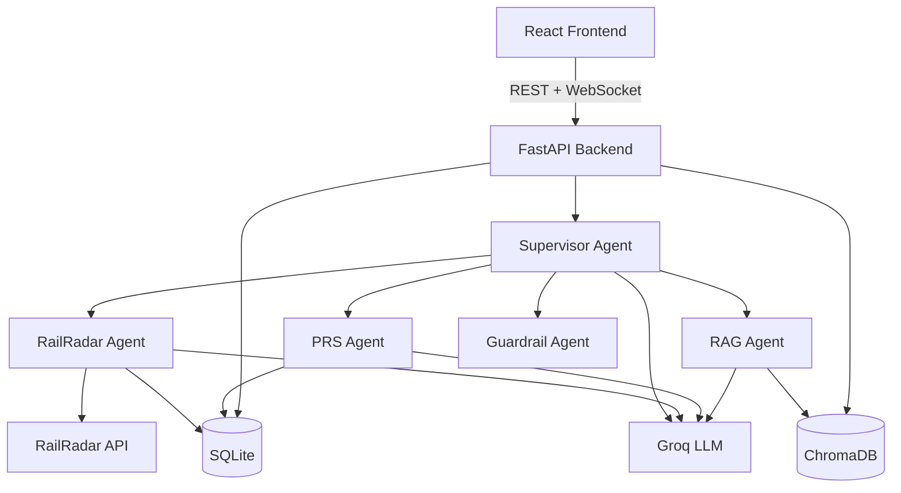

# Indian Railway Assistant Bot

An AI-powered chatbot for Indian Railways queries: train search, PNR status, seat availability, IRCTC policies, and live PNR watch alerts.

## What Works

- Train search, live status, route lookup, and station resolution through the RailRadar agent
- PNR status lookup and watchlist alerts from the PRS agent
- IRCTC policy answers from the RAG agent with source-backed retrieval
- Rule-based supervisor routing with LLM fallback only when needed
- Persistent browser session history and structured source / trace panels in the frontend

## Architecture



## Prerequisites

- Python 3.11+
- Node.js 18+
- Groq API key (free tier at [console.groq.com](https://console.groq.com))
- RailRadar API key (optional — app falls back to SQLite mock data)

## Quick Start

### 1. Clone and configure

```bash
cp .env.example .env
# Edit .env and set GROQ_API_KEY (and optionally RAILRADAR_API_KEY)
```

### 2. Run setup

**Windows (PowerShell):**
```powershell
.\scripts\setup.ps1
```

**Linux / macOS:**
```bash
chmod +x scripts/*.sh
./scripts/setup.sh
```

Setup installs dependencies, creates `backend/railway.db`, and builds Chroma vector indexes for FAQ and station resolution.

### 3. Start services

**Terminal 1 — Backend (port 8005):**
```powershell
.\scripts\run-backend.ps1
```
```bash
./scripts/run-backend.sh
```

**Terminal 2 — Frontend (port 5173):**
```powershell
.\scripts\run-frontend.ps1
```
```bash
./scripts/run-frontend.sh
```

Open [http://localhost:5173](http://localhost:5173).

## Demo PNR Numbers

These are seeded in the SQLite database for testing:

| PNR | Status | Train |
|-----|--------|-------|
| 2145678901 | CNF | 12301 |
| 2145678903 | WL/12 | 12627 |
| 2145678904 | RAC/3 | 12621 |

Try:
- `Check PNR 2145678903`
- `Watch PNR 2145678903`

## Environment Variables

| Variable | Required | Description |
|----------|----------|-------------|
| `GROQ_API_KEY` | Yes | Groq LLM for intent classification and responses |
| `GROQ_MODEL` | No | Default: `llama3-8b-8192` |
| `RAILRADAR_API_KEY` | No | RailRadar train data API; SQLite used if missing |
| `RAILRADAR_BASE_URL` | No | Default: `https://api.railradar.in/v1` |
| `RAILRADAR_RATE_LIMIT` | No | Max requests per minute (default: 10) |
| `LIVE_TRAIN_API_BASE_URL` | No | Secondary live status provider |
| `LIVE_TRAIN_API_KEY` | No | Auth for secondary live status provider |

## API Endpoints

| Method | Path | Description |
|--------|------|-------------|
| GET | `/` | Health check |
| POST | `/api/chat` | Send chat message |
| GET | `/api/pnr-watchlist/{session_id}` | List watched PNRs |
| POST | `/api/pnr-watchlist` | Add PNR to watchlist |
| GET | `/api/live-train/{train_no}` | Live train status |
| WS | `/api/ws/{session_id}` | PNR status change alerts |

## Troubleshooting

**Backend fails on import / station resolution errors**
Run bootstrap manually: `python backend/bootstrap.py`

**RAG returns empty answers**
Rebuild FAQ index: `python backend/rag_setup.py`

**Groq quota exceeded**
Agents fall back to rule-based or offline responses. Check your Groq dashboard or wait for quota reset.

**RailRadar API errors**
Train search and live status fall back to SQLite data or clearly labeled fallback output. Check `RAILRADAR_API_KEY` in `.env`.

**Frontend cannot reach backend**
Ensure backend is running on port **8005** (Vite proxy target in `frontend/vite.config.js`).

## Docker (optional)

```bash
docker compose up --build
```

Backend: [http://localhost:8005](http://localhost:8005)  
Frontend: [http://localhost:5173](http://localhost:5173)

## Portfolio Notes

Recommended additions for presentation:
- 2 to 4 screenshots showing train search, PNR watchlist, and source trace panels
- A short demo video covering one train search and one PNR alert flow
- A simple architecture diagram export for the README or project report
- A short note explaining that RailRadar/API-backed answers are preferred, with clear fallback behavior when offline

## Project Structure

```
backend/
  main.py           FastAPI entry point
  bootstrap.py      DB + Chroma setup
  database.py       SQLite models and seed data
  agents/           Supervisor, RailRadar, PRS, RAG, Guardrail
  services/         RailRadar client, cache, station resolver
frontend/
  src/App.jsx       Chat UI
scripts/            Setup and run helpers
```
